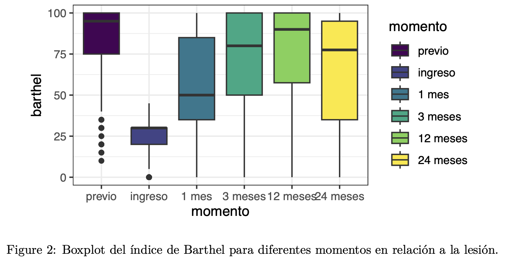
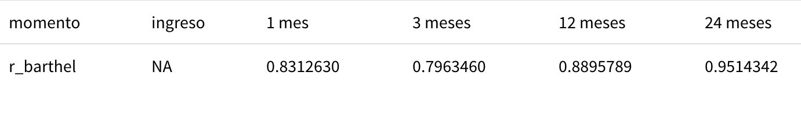
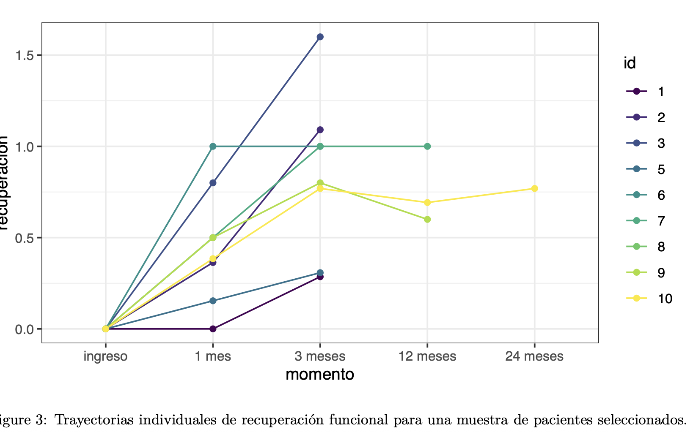
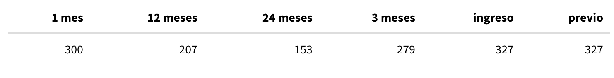
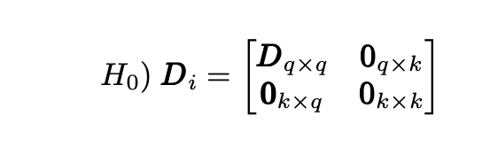

```{r setup, include = F , warning = F }
if(!require(pacman)) {
  install.packages("pacman")
}

library(xaringanthemer)


pacman::p_load(
  RefManageR
)

#Libreria car 
pacman::p_load_gh(
  "gadenbuie/xaringanExtra"
)
# Configuración del tema Xaringan:
style_duo_accent(
  primary_color = "#010788",
  secondary_color = "#01B5FE",
  header_font_google = google_font("Titillium Web", "600"),
   text_font_google   = google_font("Crimson Pro", "300", "300i"),
   code_font_google   = google_font("IBM Plex Mono"),
   base_font_size = "20px",
   text_font_size = "1rem",
   code_font_size = "0.6rem",
   code_inline_font_size = "1.2em",
   footnote_font_size = "0.6em",
   header_h1_font_size = "1.7rem",
   header_h2_font_size = "1.50rem",
   header_h3_font_size = "1.2rem"
)

xaringanExtra::use_xaringan_extra(
  c(
    "tile_view",
    "panelset",
    "progress_bar"
  )
)


xaringanExtra::style_panelset_tabs(
  active_foreground = "#0051BA",
  hover_foreground = "#d22",
  font_family = "Roboto"
)

xaringanExtra::use_banner(
  bottom_left = "bit.ly/my-awesome-talk",
  exclude = "title-slide"
)

xaringanExtra::style_banner(
  text_color = "#1874CD",
  background_color = "#F0F8FF"
)


options(htmltools.dir.version = FALSE)
knitr::opts_chunk$set(
  warning = F, 
  echo = F ,
  out.width = "450px",
  dpi = 200, 
  fig.retina =2
)


if(!require(pacman)) {
  install.packages("pacman")
}


options(kableExtra.latex.load_packages = FALSE)


```


```{r,include=F}
library(readxl)
library(tidyverse)
library(rstatix)# para hacer ANOVA RM
library(GGally)
library(lme4)
library(lmerTest) #para incluir los p valores
library(kableExtra)
library(performance)
library(knitr)


```


class: header_background

# Introducción 

El estado físico y funcional del cuerpo humano desempeña un papel central en la calidad de vida de un individuo. A partir de cierta edad se producen cambios fisiológicos que afectan a varios sistemas de forma progresiva, entre ellos el musculo-esquelético. La disminución de la densidad osea incrementa la fragilidad en los huesos y favorece la aparición ante impactos relativamente leves. Este suceso se ve acelerado particularmente en mujeres tras la menopausia. Paralelamente, la pérdida de masa muscular, la reducción de reflejos y el deterioro del control motor y del equilibrio contribuyen a un mayor riesgo de caídas en adultos mayores.

En adultos mayores, lesiones de este índole afectan directamente su autonomía y capacidad para realizar actividades básicas de la vida diaria. La recuperación funcional posterior a estos eventos es un proceso complejo influido por factores individuales (edad, sexo), condiciones de vida y el tratamiento recibido, ya sea fisioterapia u opciones quirúrgicas.

Debido al componente dependiente de los datos, dado a que estos resultan ser múltiples mediciones de un mismo individuo, contar con herramientas que permitan evaluar la evolución funcional de los pacientes resulta fundamental. Medidas estandarizadas como el Índice de Barthel permiten cuantificar el nivel de independencia antes y después del traumatismo, y constituyen un insumo valioso para estudiar trayectorias de recuperación. Los modelos multinivel representan una estrategia estadística adecuada para analizar datos longitudinales, capturar variabilidad individual en los procesos de cambio y evaluar el efecto diferencial de los tratamientos, de acuerdo con los objetivos del estudio presentado en este informe.

---

class: header_background

# Datos

Se cuenta con información longitudinal de 327 adultos mayores que sufrieron un traumatismo de muñeca, producto de una caída. Para cada individuo se registran siete variables vinculadas a factores personales y el contexto temporal de la medición. Se excluyó un individuo que presentaba dos fracturas en años distintos sin información funcional previa suficiente para reconstruir una trayectoria longitudinal consistente.

---
class: header_background

# Descripción de las variables 

Para la creación de modelos se establece como variable dependiente la recuperación del paciente, **recuperación**. Previo a crear los modelos, se realizaron algunos ajustes sobre los datos:

-   Dado que al utilizar **recuperación** como variable dependiente las observaciones de momento previo carecen de interpretación, las mismas fueron excluidas del análisis longitudinal. En su lugar se agrega una variable **b_prev** que indica el valor de índice de Barthel previo a la lesión. La misma se va a centrar respecto a su media (84.3578).


-   Dado que **recuperación** se establece en 0 al momento del ingreso, mantener dicho momento produciría una constante sin interpretación sustantiva y dificultaría la interpretación de la variabilidad entre sujetos. Se decide excluir dichas observaciones y, en cambio, agregar una variable `b_ing` que indica el valor de índice de Barthel al momento del ingreso. La misma se va a centrar respecto a su moda (30). Dado a que estamos sacando esta observación y que los únicos momentos que estaban para todos los individuos eran el previo y el ingreso, actualmente se va a modelar para 300 individuos.

-   Considerando los cambios previos, la primera observación longitudinal se define en el momento **1 mes**. Si se define este como momento 0, permite una mejor interpretación de las constantes. Es por ello que la variable **momento2**, tomando en cuenta los meses transcurridos, se codifica {0, 2, 11, 23} para los momentos 1 mes, 3 meses, 12 meses y 24 meses, respectivamente.

-   Respecto a la edad, siguiendo la literatura que indica el umbral critico referente a la densidad osea, se decide centrar la variable respecto a 60, con el fin que la interpretación de la constante refiera a la recuperación promedio en el umbral, y varíe para cada año por sobre el mismo ($edad2 = edad-60$).


---
class: header_background

# Variables seleccionadas 

| Variable     | Descripción                                         | Valores               | Nivel   |
|--------------|-----------------------------------------------------|------------------------|---------|
| recuperacion | Variable dependiente                                | Continua [-0.67,1.60] | nivel 1 |
| tratamiento  | Tipo de tratamiento                                 | cirugía / fisioterapia | nivel 2 |
| domicilio    | Recuperación en domicilio o institución             | sí / no               | nivel 2 |
| sexo         | Sexo del individuo                                   | M / F                 | nivel 2 |
| momento2     | Tiempo respecto al primer mes                        | 0, 2, 11, 23          | nivel 1 |
| edad2        | Edad centrada en 60                                  | [5,41]                | nivel 2 |
| b_prev       | Barthel previo                                       | [0,100]               | nivel 2 |
| b_ing        | Barthel ingreso                                      | [0,100]               | nivel 2 |


Nota: Se decidió no incorporar la variable Barthel al modelo debido a que como se mencionó anteriormente, esta se utiliza para construir la variable dependiente, por lo que el incluirla en el modelo llevaría a que absorba el efecto de las demás variables y se generen interpretaciones erróneas.

---

class: header_background

#Análisis exploratorio 

.center[

]
---
class: header_background
#Análisis exploratorio 

Se puede observar la alta correlacion entre Barthel y la recuperación en cada momento del tiempo, esto tiene sentido debido a como se define la variable recuperación $recuperacion = \frac{barthel_{actual}-barthel_{ingreso}}{barthel_{previo}-barthel_{ingreso}}$
.center[

]
---
class: header_background

#Análisis exploratorio 

A continuación, se presenta un segundo gráfico con la evolución en el tiempo de diez de los pacientes. Se identifica que todos comparten el mismo punto inicial, donde la tasa de recuperación al ingreso en el hospital vale 0. Esto tiene sentido ya que es el momento en el que sufrieron el traumatismo, previo a comenzar el tratamiento.

Se puede observar que las pendientes de las trayectorias difieren, y que, además, hay algunas más largas que otras, indicando que hay pacientes a los que no se les realizó un seguimiento continuo en el tiempo o que abandonaron el tratamiento.



---

class: header_background

#Análisis exploratorio

Se observa un diseño desbalanceado en la variable temporal momento, dado que la cantidad de observaciones disponibles difiere entre los distintos tiempos de medición.



---

# Metodología 

Al trabajar con medidas repetidas, hay varios modelos posibles, entre ellos el RM – ANOVA, el cual es una adaptación del modelo ANOVA para medidas repetidas. Este no es el que se utilizó para el presente análisis, ya que supone que los datos deben estar balanceados, y como se mencionó anteriormente, en los datos disponibles esto no sucede.

Otro modelo posible, y con el que se decidió trabajar es el Modelo de Efectos Mixtos (LME), debido a que es mucho más flexible con respecto a los supuestos y presenta varias ventajas con respecto al modelo anterior.

Dado al tipo de datos, se identifica a los individuos y sus variables como el nivel 2 $(i)$, mientras que las observaciones para cada individuo son de nivel 1 $(t)$.

---
class: header_background

# Modelos 

Se comienza por discernir la estructura apropiada de la matriz $\pmb D$. Bajo la hipótesis nula, se asume que ningún efecto aleatorio $k$ tiene un aporte significativo al modelo (modelo lineal)



A partir de los modelos ajustados con `lmer(REML = FALSE)`, la significación de los componentes de varianza se evalúa empleando la mezcla de distribuciones propuesta por @Stram1994.

Una vez establecida la estructura de $\pmb D$, se crearon diversos modelos LME utilizando la función `lmer(`) del paquete `lme4`, además se aplicó la corrección de los grados de libertad de Kenward-Roger, la cual presenta ventajas sobre la corrección Satterthwait especialmente en muestras pequeñas y datos desbalanceados.

---

class: header_background

# Resultados 

Se hace el procedimiento "forward" donde se parte de un modelo base solo con constante aleatoria, hasta llegar al modelo final. Se compara cada modelo mediante el test de razón de verosimilitud.

---

class: header_background

# Estructura de la matriz **D**

Ajustamos tres modelos:

 Modelo 0 : $Recuperacion_{it} = \beta_{0} + \epsilon_{it}$
 
 Modelo 1: $Recuperación_{it} =  \beta_{0i} + \epsilon_{it}$
 
 con $\beta_{oi} = \gamma_{00} + \eta_{0i}$


Dado el resultado del test se adopta como estructura aleatoria final un modelo con constantes y pendientes aleatorias. El modelo jerárquico resultante es

Modelo 2: $Recuperacion_{it} = \beta_{oi} + \beta_{1i}momentos_{it} + \epsilon_{it}$

 con $\beta_{oi} = \gamma_{00} + \eta_{0i} ,\  \beta_{1i} = \gamma_{10} + \eta_{1i} \qquad i=1,2,...,327\quad t=0,2,11,23$ 
---

class: header_background

# Modelos

Primeramente veremos de agregar `momento2` como efecto fijo, dado al factor longitudinal.

para ello nos valemos del test de razon de verosimilitud 

Hacemos la prueba de hipotesis 

$H_0: \gamma_{10} = 0 \ vs \ H_1 \gamma_{10} \neq 0$

El p valor del test dio  0.1245 por lo que no rechazamos la hipotesis nula, es decir no hay suficiente evidencia para decir que el efecto fijo de momentos aporte información adicional. 

---

#Modelos

class: header_background

Se incorporan como efectos fijos otras variables como la edad al momento del traumatismo, el sexo y domicilio del paciente, que como se mencionó anteriormente, la literatura las identifica como variables relevantes.

Primero se agrega como variable fija el sexo, y se hace el test de verosimilitud con el modelo base (pendiente e intercepto aleatorio), dando un p valor > al 0.05, por lo cual no incluimos esta variable en el modelo.

Luego, ajustamos un modelo con edad como variable fija, y lo comparamos con nuestro modelo base, llegando a que esta covariable es significativa. 

Por úlitmo, incorporamos la variable domomicilio al modelo anterior, dandonos sigificativa. 

De los modelos anteriores, se detecta que en contradicción con lo que la literatura señalaba, el sexo del paciente no es significativo para explicar la recuperación del mismo, por lo que se decide prescindir de esta variable.

---
class: header_background

# Modelos 

Aemás, se decide incluir la variable tratamiento como efecto fijo. Al incorporarla de esta forma se puede contrastar el objetivo planteado, identificar el efecto del tratamiento sobre la recuperación en si mismo, es decir, detectar si la evolución en la recuperación de los pacientes varía según el tratamiento proporcionado.

Como era de esperarse, el test de máxima verosimilitud nos indica que tratamiento agrega mucha información al modelo.

Se quiere ver si las variables creadas a partir de las observaciones de los momentos eliminados (previo e ingreso) pueden aportar una mayor calidad de ajuste.

---
class: header_background

# Modelos 

La variable que indica el indice de Barthel del cual inicialmente deben recuperarse los pacientes parece estar agregando una mayor calidad de ajuste, aunque en menos proporción a las variables anteriores. Sin embargo el estado previo a la lesión no proporciona nada.

---
class: header_background

## Modelo Final:

Dado las variables del modelo final, la formula jerárquica toma la siguiente forma:

$$recuperacion_{it} = \beta_{0i} + \beta_{1i}momento2_{it} + \varepsilon_{it} \qquad i=1,2,...,327\quad t=0,2,11,23$$
$$\beta_{0i}=\gamma_{00}+\gamma_{01}edad2_{i}+\gamma_{02}domicilio_{i}+\gamma_{03}tratamiento_i + \gamma_{04}b\_ing_i + \eta_{0i}$$
$$\beta_{1i}=\gamma_{10}+\eta_{1i}$$
---
class: header_background

#Modelo Final 

-  $\gamma_{00}$ representa el promedio de recuperación para un individuo que al momento del traumatismo se encuentra en el umbral de riesgo (60 años), no reside en domicilio propio, el tratamiento recibido fue cirugía y al momento del ingreso su indice de Barthel fue de 30.

- $\gamma{10}$ es el efecto fijo promedio del tiempo `momento2` sobre la recuperación funcional al momento _primer mes_ tras lesión.

--- 
class: header_background

# Estimaciones 

-  $\gamma_{00}=0.66$ indica que, bajo las condiciones antes mencionadas, el promedio global de recuperación es de 0,66, es decir el 66%.

- $\gamma_{01}=-0.006$ indica que, para cada año por sobre la región critica de densidad osea (60 años), la recuperación global del individuo disminuye un 0,006.

- $\gamma_{02}=0.12$ indica que, si el individuo reside en domicilio propio, la recuperación global aumenta 0,12, tal como indica la literatura.

-  $\gamma{03}=0.17$ indica que, si el individuo se somete a tratamiento de fisioterapia en vez de cirugía, la recuperación global aumenta 0,17.

---

class: header_background

# Estimaciones 

-  $\gamma_{04}=0.004$ indica que, por cada unidad aumentada sobre la moda de el indice de Barthel al ingreso (30), la recuperación aumenta un 0,004. Es decir, cuanto menos haya decaído tu calidad de vida, es mas fácil recuperarse.

-  Para $\eta_{0i}$, la varianza se estima en $0.0562246$, lo cual representa la variabilidad entre sujetos en el intercepto del modelo. Es decir, indica cuánto difieren entre sí los niveles iniciales de recuperación funcional (cuando todas las covariables están centradas) entre los diferentes individuos.

-  Para $\eta_{1i}$, la varianza se estima en $0.0002257$, lo que sugiere que la variabilidad entre sujetos en la pendiente asociada al tiempo `momento2` es extremadamente baja. En términos prácticos, esto implica que la evolución temporal de la recuperación funcional es muy similar entre individuos, y el modelo no detecta diferencias sustanciales en las tasas de cambio.

-  Para $\varepsilon_{it}$, la varianza se estima en $0.0946870$, lo cual representa la variabilidad individualmente no explicada por el modelo, es decir, las diferencias residuales en la recuperación de un mismo individuo a lo largo del tiempo, luego de controlar por los efectos fijos y aleatorios.

---    
 
 
 
     

